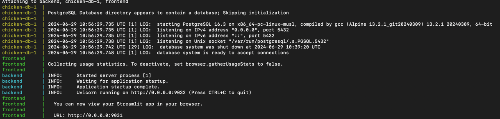

# Цыплята

### Архитектура проекта

1) **frontend**

- **counter** - директория, содержащая алгоритм подсчета в файле helper.py и папку YOLO
- **pages** - директория, содержащая код к страницам (один файл - одна страница).
- .**streamlit** - содержит кредиты авторизации

2) **backend**

- **main.py** - файл со всякими апишными методами
- **data_models** - директория, содержащая классы для таблиц в бд

### Инструкция

1) склонить проект
2) поменять порты на свои в следующих файлах:

- docker-compose.yml
- frontend/Dockerfile
- backend/Dockerfile
- а также на всех страницах streamlit в frontend/pages/

3) Разархивировать папку **yolo.zip** в frontend/counter
4) (опционально) Мне не удалось поднять локально на ноуте без extra_hosts в сервисе **frontend**:

`    extra_hosts:
- "host.docker.internal:host-gateway"`

5) `docker compose build`
6) `docker compose up`
7) Если всё ок, то в каждом сервисе должно высветиться что-то подобное (когда поднимаешь первый раз, то один бэкенд
   может создать быстрее чем бд, поэтому нужно еще раз сделать `docker compose up`):

8) Далее переходишь по ссылке, которая указана во фронте. Мб она не откроется, тогда 0.0.0.0 нужно поменять на
   localhost.
9) Готово!

### Куда смотреть?

За отображение на странице стримлита и за подсчет отвечают два файла:

1) frontend/pages/Добавить_информацию_о_партии.py. Все пояснения в этом файле
2) frontend/counter/helper.py - подсчет. Все пояснения в этом файле. Де-факто, интересует здесь только одна
   функция `display_video`,
   потому что она отвечает за получение кадров и проверку камеры.
   Сам алгоритм подсчета такой:

**Есть три интервала.**

- если цыпленок попадает в первый интервал, то делаем +1 и запоминаем, что мы его уже посчитали.
- аналогично со вторым.
- третий нужен грубо говоря для дебага, если что-то плохо посчиталось.

### Пояснения:

1) Столько много кода в алгоритме подсчета, потому что я учитываю склеенных цыплят. Без них было бы намного-намного
   проще очевидно. Буквально 100 строк.
2) Почему не использовала supervision.LineZone и ByteTrack? Потому что макисмальной точности, которой я смогла добиться
   с помощью supervision, это 0.74
3) Почему не использовала дефолтный трекер Yolo? Потому что вышло еще хуже.

По поводу последних двух пунктов: мне кажется, что так происходит из-за скорости конвеера (цыпленок пробегает весь
видимый путь за 4 кадра), потому что я использовала их в других задачах и всё было ок.
